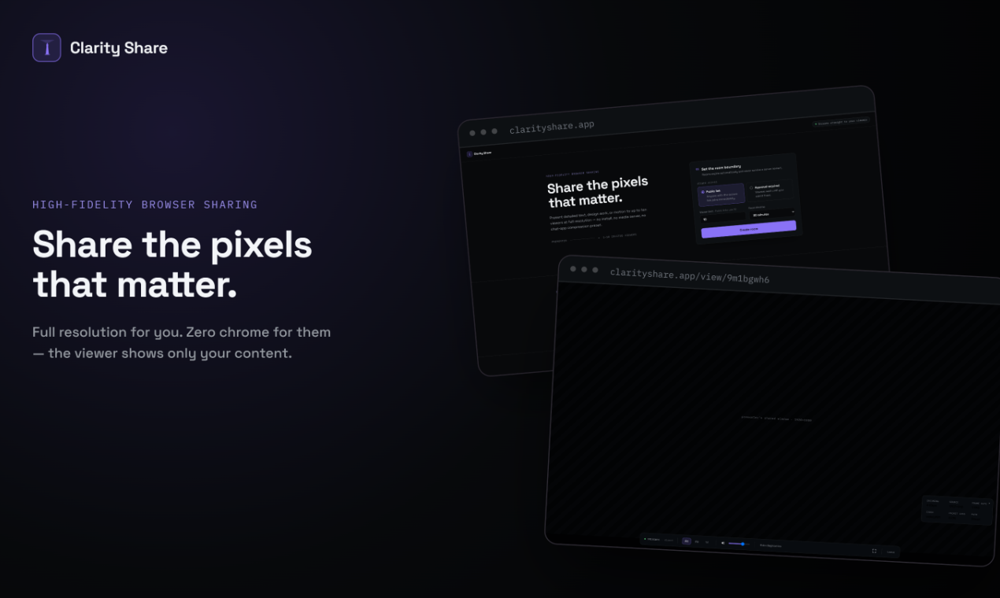

<p align="center">
  
</p>

<h1 align="center">Clarity Share</h1>

<p align="center">
  <strong>Share the pixels that matter.</strong><br>
  High-fidelity, expiring screen sharing from your browser to theirs.
</p>

<p align="center">
  
  
  
  
</p>



Clarity Share is an open-source screen-sharing application for one presenter and up to ten viewers. It is designed for detailed text, design work, code, and motion that should remain legible after it leaves your screen.

There is nothing for viewers to install and no meeting UI to work around. Send an expiring link; the viewer opens a focused, full-window canvas containing your share and only the controls they need.

> Clarity Share is deliberately not a meeting suite. It has no accounts, recording, chat, remote control, or server-side media processing. It does one job: high-quality browser sharing with visible, understandable connection state.

## Why Clarity Share?

- **Detail-first capture.** Text and Motion modes target different frame-rate and bitrate profiles, with selectable 2560 x 1440 (default) or 3840 x 2160 capture targets and up to 60 FPS where the browser, source, and network allow it.
- **A viewer made for the content.** Fit, zoom, fullscreen, volume, and diagnostics stay out of the way until needed.
- **Independent quality per viewer.** Every admitted viewer gets a dedicated peer connection, encoding profile, stats collector, adaptation controller, and recovery path.
- **Access that expires.** Rooms last from one to eight hours, accept one to ten viewers, and can admit anyone with the link or require presenter approval.
- **Privacy you can reason about.** Media travels browser-to-browser when possible, falling back to your own TURN relay when direct connectivity fails. The application server never ingests media.
- **Useful live diagnostics.** See bitrate, resolution, frame rate, codec, packet loss, round-trip time, quality profile, and whether each connection is direct or relayed.
- **Accessible by design.** The interface targets WCAG 2.2 AA with semantic controls, complete keyboard access, visible focus, non-color status cues, and reduced-motion support.

## How it works

```text
                    HTTPS / WSS: rooms, auth, signaling
Presenter browser <-----------> clarity-server <-----------> Viewer browser
        |                                                        |
        +========== encrypted WebRTC audio/video ================+
                    direct when possible, TURN when needed
```

1. The presenter creates an expiring room and chooses public-link or approval-required admission.
2. Clarity Share generates a viewer invitation whose secret lives in the URL fragment, never in an HTTP request.
3. An admitted viewer negotiates an independent WebRTC connection with the presenter.
4. The Rust server coordinates room policy and signaling. Media goes directly between browsers or through coturn as encrypted packets.
5. Connection metrics drive per-viewer quality adaptation without degrading every other viewer.

System audio is included only when the browser and selected source provide it. Clarity Share never requests microphone or camera access.

## What you get

| Presenter | Viewer | Self-hoster |
| --- | --- | --- |
| Text and Motion capture modes | Installation-free browser viewing | One deployable Rust application |
| Adaptive or fixed quality | Distraction-free, responsive canvas | Caddy HTTPS/WSS termination |
| Automatic or explicit codec choice | Fit, zoom, fullscreen, and audio controls | coturn STUN/TURN fallback |
| Live upload history and per-viewer stats | Direct/relay path and stream diagnostics | Health and readiness endpoints |
| Approve, reject, remove, or recover viewers | Optional display name | Structured, secret-redacted logs |
| Change source without rebuilding the room | Signaling and media reconnection | Docker Compose for one Linux VPS |

## Quick start

### Prerequisites

- Rust 1.95 or newer with `rustfmt` and `clippy`
- GStreamer 1.22+ development libraries with the base, good, and bad plugin sets (used by the native client crates); native screen sharing additionally uses the PipeWire GStreamer plugin and an xdg-desktop-portal at runtime
- Node.js 24
- pnpm 11.9 through Corepack

Generate the shared protocol artifacts and install the frontend dependencies:

```bash
cargo run -p clarity-xtask -- export-protocol
cd web
corepack enable
pnpm install --frozen-lockfile
pnpm generate:validators
```

Start the Rust service from the repository root:

```bash
cargo run -p clarity-server
```

Then start Vite in a second terminal:

```bash
cd web
pnpm dev
```

Open [http://127.0.0.1:5173](http://127.0.0.1:5173). Vite proxies API and WebSocket traffic to the Rust service at `127.0.0.1:3000`. Browsers treat loopback addresses as secure contexts, so screen capture works without local TLS.

## Self-hosting

The included production stack runs on one public Linux VPS:

- `clarity-server` serves the API, WebSocket signaling, and embedded React build.
- Caddy manages HTTPS and proxies application traffic.
- coturn supplies STUN and TURN, including short-lived credentials issued by the application.

```bash
cp .env.example .env
# Replace every REPLACE_WITH value and configure your domains and public IP.
docker compose -f deploy/compose.yaml build --pull
docker compose -f deploy/compose.yaml up -d
curl --fail https://share.example.com/readyz
```

Read the [deployment guide](docs/DEPLOYMENT.md) before exposing the stack. A working deployment requires DNS, a public IPv4 address, UDP support, firewall rules for the configured TURN relay range, and three independently generated secrets.

## Architecture

Clarity Share is a Rust workspace with a strict React/TypeScript frontend:

| Path | Responsibility |
| --- | --- |
| `crates/clarity-protocol` | Authoritative Serde models, JSON Schema, and generated TypeScript protocol types |
| `crates/clarity-core` | Room actors, authorization, credential digests, lifecycle, and TURN credentials |
| `crates/clarity-server` | Axum HTTP/WebSocket transport, rate limits, security headers, and embedded assets |
| `crates/clarity-media` | WebRTC broadcast and playback engines for the native client, backed by GStreamer |
| `crates/clarity-client` | Native presenter/viewer/presence sessions and the `clarity` CLI |
| `crates/clarity-identity` | Device-local Ed25519 identity, friend codes, contacts, and settings |
| `crates/clarity-desktop` | Native desktop GUI (`clarity-gui`, egui) |
| `crates/clarity-xtask` | Deterministic export of protocol artifacts to the frontend |
| `web` | React 19 application, WebRTC sessions, quality adaptation, and diagnostics |
| `deploy` | Docker, Caddy, coturn, and single-VPS Compose configuration |

The room registry stores actor handles rather than shared mutable rooms. One Tokio task owns each room, while each frontend peer connection owns its own media lifecycle. See [Architecture](docs/ARCHITECTURE.md) for the detailed dependency and runtime model.

## Security and privacy

- Room identifiers contain 96 bits of randomness; presenter, invitation, and resume secrets contain 256 bits.
- Viewer secrets are carried in URL fragments, moved to `sessionStorage`, and immediately removed from the address bar.
- The server retains domain-separated HMAC digests rather than raw room secrets.
- WebSocket clients authenticate before admission or signaling, and approval-gated viewers cannot exchange SDP before approval.
- WebRTC uses DTLS-SRTP in transit, including through TURN.
- Diagnostic exports redact URLs, credentials, SDP, ICE candidates, and IP-shaped values.
- Production responses include CSP, HSTS, a restrictive Permissions Policy, and other security headers.

This design does not provide verified viewer identity or application-layer end-to-end identity verification. Direct peer-to-peer connections expose network endpoints to the connected peer. Read the complete [security model](docs/SECURITY.md) before using Clarity Share for sensitive material.

## Current limits

- Rooms live in memory and end when the application restarts.
- The topology is one presenter to at most ten viewers; presenter upload grows roughly linearly with viewer count.
- Relayed sessions consume VPS ingress and egress and add latency.
- Presentation requires a supported desktop browser. Mobile browsers may view, but are not part of the tested support matrix.
- Resolution, frame rate, codecs, hardware encoding, and system audio depend on the browser, operating system, source, and network.
- There is no database, account system, recording, chat, remote control, voice calling, SFU, or server-side transcoding.

## Development

Run the same core checks used by CI:

```bash
cargo run -p clarity-xtask -- export-protocol
cargo fmt --all -- --check
cargo clippy --workspace --all-targets --all-features --locked -- -D warnings
cargo test --workspace --all-features --locked
cd web
pnpm generate:validators
pnpm lint
pnpm typecheck
pnpm test
pnpm build
```

The Playwright suite uses a test-only synthetic canvas and never opens the native capture picker:

```bash
cd web
pnpm exec playwright install chromium
pnpm playwright
```

The forced-relay acceptance test requires a reachable coturn instance; follow the [WebRTC diagnostics guide](docs/WEBRTC-DIAGNOSTICS.md#forced-relay-acceptance-test).

Contributions and bug reports are welcome. Keep protocol changes in `clarity-protocol`, regenerate the checked-in frontend artifacts, and include tests for behavior changes.

## Documentation

- [Architecture](docs/ARCHITECTURE.md) - runtime topology, room actors, frontend boundaries, media lifecycle, and recovery
- [Security](docs/SECURITY.md) - credentials, signaling authorization, browser policy, TURN, and threat limits
- [Deployment](docs/DEPLOYMENT.md) - DNS, firewall, TLS, coturn, operations, upgrades, and rollback
- [WebRTC diagnostics](docs/WEBRTC-DIAGNOSTICS.md) - direct/relay verification and troubleshooting
- [Product principles](PRODUCT.md) - users, purpose, brand, accessibility, and interaction principles

## License

Clarity Share is available under the [MIT License](LICENSE).
